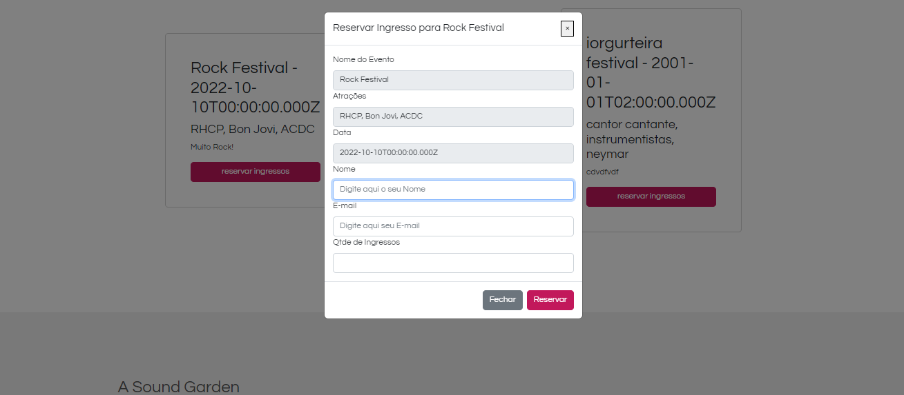
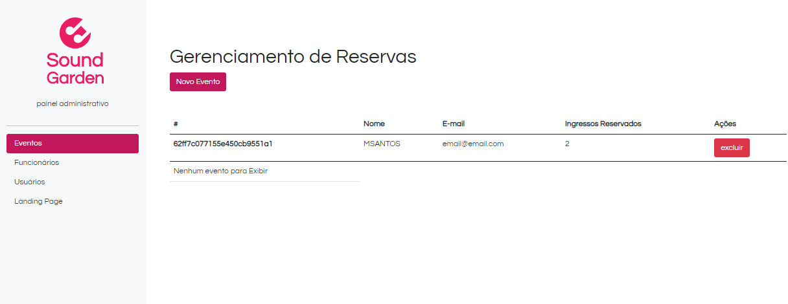

<a id='ancora'></a>
# Projeto Sound Garden - Gama Academy - XP 44 🚀

<br><br>

- [Sobre a Gama Academy](#ancora1) <br>
- [Sobre o Gama Experience](#ancora2) <br>
- [Sobre o Projeto](#ancora3) <br>
- [Competências Desenvolvidas](#ancora4) <br>
- [Entregável](#ancora5) <br>
- [Entregável (Opcionais)](#ancora6) <br>
- [Execução](#ancora7) <br>
- [Prints de Execução](#ancora8) <br>
- [Colaboradores](#ancora9)

<br><br>


<a id="ancora1"></a>
## Sobre a Gama Academy 🏫

<br>

Empresa de educação que prepara talentos para o mercado digital. Em seus programas educacionais, as pessoas participantes enfrentam desafios reais, se conectam com empresas digitais, recebem mentorias de profissionais que estão mandando bem em suas áreas e, ainda têm a oportunidade de ensinar e aprender com a nossa comunidade visando o emprego, transição de carreira e o life long learning.

<br>

<a id="ancora2"></a>
## Sobre o Gama Experience 👨🏽‍💻

<br>

É um curso com duração de 6 meses, com o objetivo de formar os melhores juniores do mercado, nas áreas de Desenvolvimento Web e Designers UX/UI! A primeira versão do curso foi lançada pela Gama Academy em 2016 e já empregou mais de 3.000 pessoas.  A versão atual contém mais de 810 horas de aulas, desafios e mentorias, com foco na  empregabilidade de nossos estudantes!

<br>

<a id="ancora3"></a>
## Sobre o Projeto ✔️

<br>

Uma casa de show chamada Sound Garden será inaugurada e precisa de um site que exiba os eventos e permita que os clientes reservem ingressos através da Landing Page.

<br>

<a id="ancora4"></a>
## Competências Desenvolvidas 📝

<br>

* HTML;
* CSS;
* JavaScript;
* Bootstrap;
* Manipulação de DOM;
* Consumo de API; [SoundGarden API](https://documenter.getpostman.com/view/3028053/UVsTp2LC)
* Conceito de CRUD (Create, Read, Update e Delete).

<br>

<a id="ancora5"></a>
## Entregável 📋

<br>

1. Criar Evento: receba os dados que o usuário inserir através do formulário da página criar-evento.html e envie essa informação para a API utilizando o método POST. ✔️
<br><br>
2. Editar Evento: para cada evento listado, existe um botão editar que deve direcionar para editar-evento.html?id=0, com o id do evento selecionado. Na página de edição, o formulário deve aparecer preenchido com os dados do evento, permitindo a edição das informações utilizando o método PUT. ✔️
<br><br>
3. Excluir Evento: para cada evento listado, existe um botão editar que deve direcionar para excluir-evento.html?id=0, com o id do evento selecionado. Na página de edição, o formulário deve aparecer preenchido com os dados do evento, porém com os campos desabilitados. Ao clicar no botão "excluir para sempre", deve fazer uma requisição na API para excluir o evento do banco de dados. ✔️
<br><br>
4. Ver reservas do evento: Listar as reservas de ingressos do evento selecionado. ✔️

<br>

<a id="ancora6"></a>
## Entregável (Opcionais)

<br>

5. Criar um banner rotativo para a primeira seção da landing page. Esse banner deverá exibir alguns eventos de destaque para os usuários. ✔️
<br><br>
6. Reserva de ingresso: ao clicar em "reservar ingresso", deve abrir um modal com formulário (nome e email), para que o usuário possa preencher os dados e reservar o ingresso. ✔️

<br>

<a id="ancora7"></a>
## Execução 💻

<br>

Clone este repositório remoto em seu equipamento:
```
git clone git@github.com:pedrorackoff/sound-garden-xp44.git
```
Ou utilize o GitHub Pages para visualizar a página:
```
https://pedrorackoff.github.io/sound-garden-xp44/index.html
```

<br>

<a id="ancora8"></a>
## Prints de execução 📷

<br>

<center></center>

<br>

<center></center>

<br>

<center></center>

<br><br>

<a id="ancora9"></a>
## 🤝 Colaboradores

Projeto desenvolvido por:

<table>
  <tr>
    <td align="center">
      <a href="https://www.linkedin.com/in/karoline-gaia-alexandre-919b31120">
        <br>
        <sub>
          <b>Karoline Gaia Alexandre</b>
        </sub>
      </a>
    </td>
    <td align="center">
      <a href="https://www.linkedin.com/in/wallace-bruno-717981150">
        <br>
        <sub>
          <b>Wallace Bruno</b>
        </sub>
      </a>
  </tr>
</table>

<br><br>

[Voltar ao Topo](#ancora)